<h1>JeastyPy: Computer vision application to classify yeast cells.</h1>
	<h2>What is JeastyPy</h2>
	<h3>Yeast Problems</h3>
	

		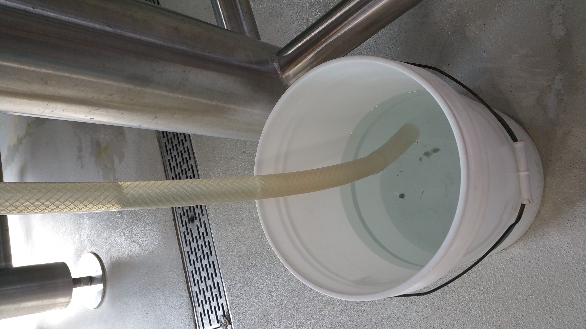
		Too little yeast can result in skunky beer, overly fruity beer, stalled fermentation
		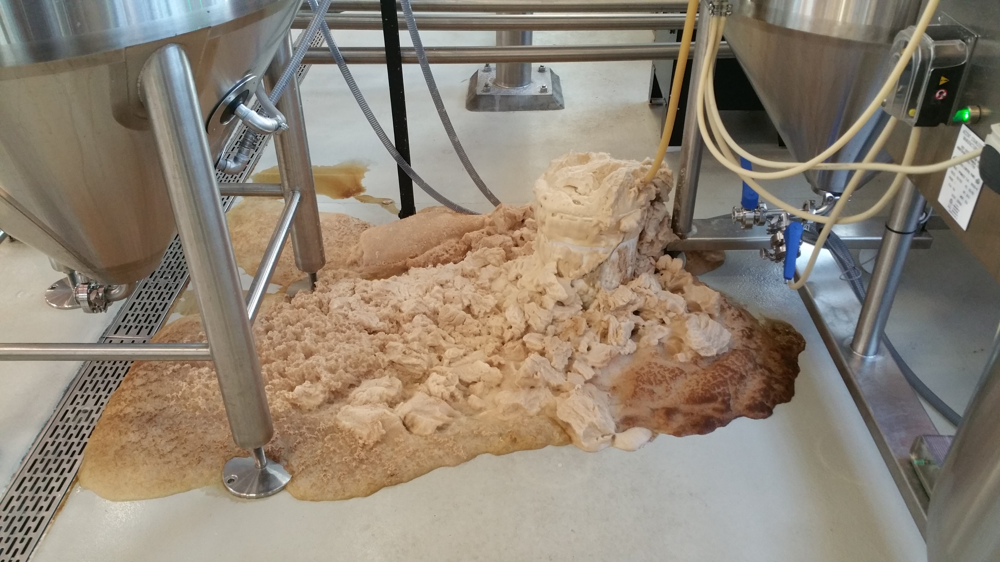
		Too much yeast can result in little flavor, blow off, volume loss
	

	<h3>Data Collecting and Preprocessing</h3>
	
The data was captured from a camera through a traditional benchtop microscope. The image was then cropped down to the portion that contains the relavent information. The individual cells then had bounding boxes drawn around them and were classified as alive or dead. Lastly the cells were seperated from the rest of the image.

	

		
		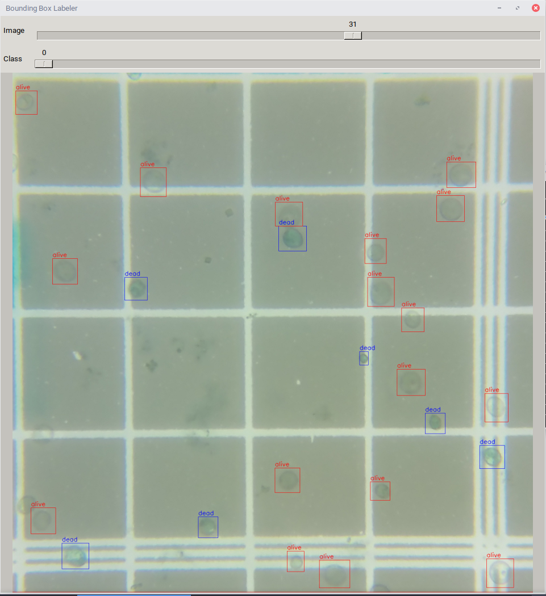
		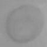
	

	<h3>Yeast viability and what it is</h3>
	
Viability is the ratio of living cells to the total number of cells. This is usually done by a lab technician using a stain like methylene blue, a microscope, and a hemocytomet to count and classify the cells. Detailed instrucition can be found on <a href="https://www.whitelabs.com/beer/cell-counting-viability-testing">WhiteLabs website</a>

	<h3>Classification: Alive vs. Dead</h3>
	<h4>Alive Cells</h4>
	

		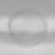
		
		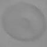
	

	<h4>Dead Cells</h4>
	

		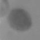
		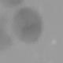
		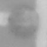
	

	<h3>Yeast vitality, lesser known</h3>
	
Vitality is a measure of how active a cell or group of cells are. There are two ways common ways this is achived. Firstly is performing a small scale fermentation with the yeast in question. The CO2 off gased is captured and measured. This takes about 24 hours to get results, but in that time the original yeast sample viability and vitality have dropped. The second solution is to use a stain that is not processed homogeniously. For this we use methylene blue again. Methylene blue works by being absorbed into all cells and staining them. Living, helathy cell will reduce the methylene blue to clear, while the dead cells stay blue, as used for viability testing. However this can also be used for Vitality testing in real time as the degree of blue tint can determin the vitality. The issue being that it is dificult to differentiate between subtle changes in saturation of blue.

	
By using computer vision not only can we address calculating viability, but also vitality as a computer can differintiate all the distinctive shades of blue

	

		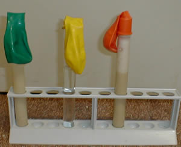
		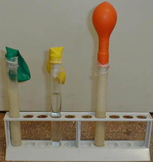
	

	
	<h2>How it works</h2>

