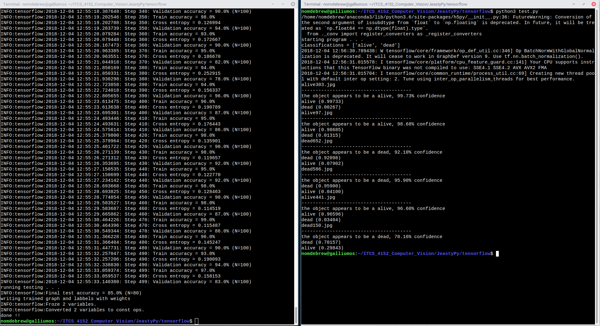

<h1>JeastyPy: Computer vision application to classify yeast cells.</h1>
<h2>What is JeastyPy</h2>
<h3>Yeast Problems</h3>

	

	Too little yeast can result in skunky beer, overly fruity beer, stalled fermentation

	

	Too much yeast can result in little flavor, blow off, volume loss

<h3>Data Collecting and Preprocessing</h3>
The data was captured from a camera through a traditional benchtop microscope. The image was then cropped down to the portion that contains the relavent information. The individual cells then had bounding boxes drawn around them and were classified as alive or dead. Lastly the cells were seperated from the rest of the image.

	
	
	

<h3>Yeast viability and what it is</h3>
Viability is the ratio of living cells to the total number of cells. This is usually done by a lab technician using a stain like methylene blue, a microscope, and a hemocytomet to count and classify the cells. Detailed instrucition can be found on <a href="https://www.whitelabs.com/beer/cell-counting-viability-testing">WhiteLabs website</a>

<h3>Classification: Alive vs. Dead</h3>
<h4>Alive Cells</h4>

	
	
	

<h4>Dead Cells</h4>

	
	
	

<h3>Yeast vitality, lesser known</h3>

Vitality is a measure of how active a cell or group of cells are. There are two ways common ways this is achived. Firstly is performing a small scale fermentation with the yeast in question. The CO2 off gased is captured and measured. This takes about 24 hours to get results, but in that time the original yeast sample viability and vitality have dropped. The second solution is to use a stain that is not processed homogeniously. For this we use methylene blue again. Methylene blue works by being absorbed into all cells and staining them. Living, helathy cell will reduce the methylene blue to clear, while the dead cells stay blue, as used for viability testing. However this can also be used for Vitality testing in real time as the degree of blue tint can determin the vitality. The issue being that it is dificult to differentiate between subtle changes in saturation of blue.

By using computer vision not only can we address calculating viability, but also vitality as a computer can differintiate all the distinctive shades of blue

	
	

<h2>How it works</h2>
While JeastyPy uses it own dataset, it leverages existing code to acomplish steps in the process.

<h3><a href="https://github.com/Cartucho/OpenLabeling">OpenLabeling</a></h3>
OpenLabeling was used to draw bounding boxes around each yeast cell and assigning a label at the same time.

After reading the <a href="openlabeling/README.md">instructions</a>, place images in 
<code>openlabeling/images</code>
Then execute 
<code>/openlabeling/run.py</code>
This will create txt files for each image in 
<code>openlabeling/bbox_txt</code>

<h3><a href="labels_to_files.ipynb">Our Code</a></h3>
This code retrieves the the text files from <code>openlabeling/bbox_txt</code> containg the all the bounding box information for each image. Each .txt file was brought into a pandas dataframe and all of the information was combined into a single dataframe. The images are then brought in as numpy arrays. OpenLabeling records the center of the bounding box, for this application the 40 pixels in each direction of the center was used. To acomplish this, smaller arrays were extracted containing single cells. At the same time the original image was a 2.25M pixels each consisting of 3 color chanels. The result was an 80x80 2D array consisting of only the blue color channel, which would be the one with the most differentiation from the other color channels given the cell stain is blue. The output was over 900 80x80 images of individual cells to be used in the next step.

<h3>TensorFlow</h3>
Copy the images into <code>/tensorflow/training_images</code> and <code>tensorflow/test_images</code>. Once in place run <code>/tensorflow/retrain.py</code> to create and train the nerural network. Next run <code>/tensorflow/test.py</code> to check against the test images that have been seperated. The accurarcy should be around 85-87%

<h2>Conclution & Future Work</h2>
The model correctly recognizes alive and dead cells 87% of the time. Interestingly it has the potential to be even better at calculating vitality.
<ul>
<li>Collect more data</li>
<li>Automate creating bounding boxes on original images</li>
<li>Get more experts to classify the individual cells</li>
</ul>

